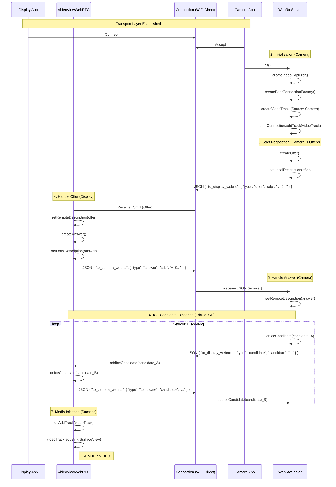

# WebRTC Connection Analysis

This document details the architecture and communication flow for establishing a WebRTC video streaming connection in the RemoteVideoCam application.

## Overview
The application uses a hybrid approach where a local transport layer (WiFi Direct, WiFi Aware, or Local Network) is established first. This transport layer is then used as the signaling channel for WebRTC to negotiate the peer-to-peer media connection.

## Key Components

### 1. Connection Strategy (`ConnectionStrategy.kt`)
*   **Role**: Connectivity Decision Maker.
*   **Function**: Determines the best available connection method based on device capabilities and current network status.
*   **Selection Logic**:
    1.  **Network**: If connected to a standard WiFi network.
    2.  **WiFi Aware**: If supported by hardware (Android O+).
    3.  **WiFi Direct**: Fallback and most common peer-to-peer method.
*   **Usage**: `Camera.kt` calls `ConnectionStrategy.getCameraConnection(context)` to get the active `ILocalConnection` implementation.

### 2. Transport Layer (`ILocalConnection` Implementations)
*   **Implementations**: `WiFiDirectServiceConnection`, `NetworkServiceConnection`, `WiFiAwareServiceConnection`.
*   **Role**: Provides the physical data channel for signaling.
*   **Responsibilities**:
    *   Manages sockets (`Socket` / `ServerSocket`).
    *   **Dynamic Role**: Acts as a Server (Group Owner) via `waitForConnection()` or Client via `connect()` depending on the WiFi Direct Group negotiation result.
    *   Handles connection lifecycle (Connect, Disconnect).
    *   **Sending**: Provides `sendMessage(String)` to send raw data.
    *   **Receiving**: Reads from the socket and forwards data to a callback (`IDataReceived`).

### 3. Application Logic & Orchestration (`Camera.kt`)
*   **Role**: Coordinator.
*   **Responsibilities**:
    *   Initializes the `ConnectionStrategy` and `WebRtcServer`.
    *   **Bridge**: Connects the `ILocalConnection` to the Application Event Buses.
        *   Subscribes to `CameraToDisplayEventBus` to send outgoing messages via the connection.
        *   Sets `UnifiedDataRouter` as the receiver for incoming messages from the connection.

### 4. Signaling & Media (`WebRtcServer.kt`)
*   **Role**: WebRTC Manager.
*   **Responsibilities**:
    *   Manages the `PeerConnectionFactory` and `PeerConnection`.
    *   Captures video from the camera and audio from the microphone.
    *   Generates SDP Offers, Answers, and ICE Candidates.
    *   **Communication**:
        *   **Outgoing**: Wraps signaling messages in JSON (`{ "to_display_webrtc": ... }`) and requests them to be sent via `CameraToDisplayEventBus`.
        *   **Incoming**: Listens to `DisplayToCameraEventBus` for messages (`{ "to_camera_webrtc": ... }`) to update the local peer connection state.

### 5. Message Routing (`UnifiedDataRouter.kt` & Event Buses)
*   **UnifiedDataRouter**: Receives raw strings from the transport layer, parses them as JSON, and routes them to the appropriate Event Bus based on JSON keys (e.g., routing `to_camera_webrtc` messages to `DisplayToCameraEventBus`).
*   **Event Buses**: `CameraToDisplayEventBus` and `DisplayToCameraEventBus` decouple the transport layer from the logic layer, allowing the app to switch connection types without changing the WebRTC logic.

## Message Flow & Media Initiation

The following diagram illustrates the exact sequence of JSON messages and object interactions that lead to a successful media stream.

### Detailed Sequence Diagram



### Media Initiation Details
The "Media Stream" is not sent as a specific message. It begins automatically when:
1.  **Signaling is Complete**: Both sides have set Local and Remote descriptions (Session Description Protocol).
2.  **ICE Connected**: The PeerConnections have found a valid network path (Candidate Pair) via the ICE exchange.
3.  **DTLS Handshake**: The connection is secured.
4.  **Track Added**: The Receiver (Display) triggers `onAddTrack` or `onAddStream`, at which point the video track is attached to the renderer (`SurfaceView`).

---

## Proposed Extension: IP Address Exchange

To ensure WebRTC candidates use the correct network interface (e.g., forcing usage of the WiFi Direct interface instead of Mobile Data), we can extend the handshake to exchange optimal IP addresses before WebRTC signaling begins.

### Implementation Strategy

#### 1. Add "DEVICE_INFO" Message Type
Define a new command to exchange network information immediately after the socket connection is established.

**Protocol:**
```json
{
  "command": "DEVICE_INFO",
  "ip_address": "192.168.49.1",
  "device_role": "GROUP_OWNER" 
}
```

#### 2. Modified Connection Flow

1.  **Transport Connected**: Socket connection established.
2.  **Exchange IPs**:
    *   **Camera** sends its IP (e.g., from `WifiP2pGroup.getOwner().deviceAddress` or local interface).
    *   **Display** sends its IP.
3.  **Store IP**: Both sides store the `remote_valid_ip`.
4.  **Filter ICE Candidates**:
    In `WebRtcServer.kt` and `VideoViewWebRTC.kt`, modify `onIceCandidate`:

    ```kotlin
    override fun onIceCandidate(candidate: IceCandidate) {
        // PROPOSED FILTER LOGIC
        if (isValidCandidate(candidate, remoteValidIp)) {
            val message = JSONObject().apply {
                put("type", TYPE_CANDIDATE)
                put("label", candidate.sdpMLineIndex)
                put("id", candidate.sdpMid)
                put("candidate", candidate.sdp)
            }
            sendMessage(message)
        } else {
            Timber.d("Filtering out irrelevant candidate: ${candidate.sdp}")
        }
    }
    
    private fun isValidCandidate(candidate: IceCandidate, targetIp: String?): Boolean {
        if (targetIp == null) return true // No filter if IP unknown
        
        // Check if candidate string contains the subnet of the target IP
        // or matches the interface we want to use.
        // Example: if target is 192.168.49.x, we only send candidates 
        // that are 192.168.49.y
        return candidate.sdp.contains(getCommonSubnet(targetIp))
    }
    ```

### 3. Benefits
*   **Faster Connection**: Removes the need for WebRTC to test candidates on irrelevant networks (like LTE).
*   **Reliability**: Prevents the connection from accidentally attempting to route through a firewall or non-routable interface.
